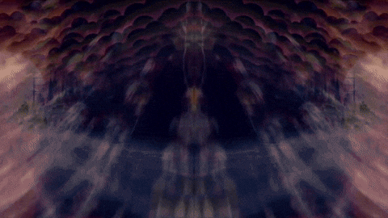
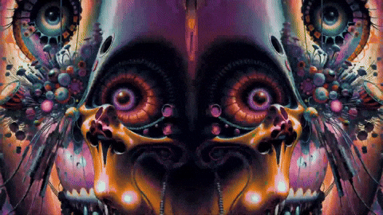
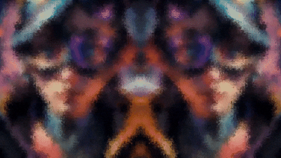
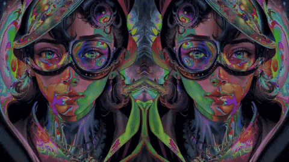
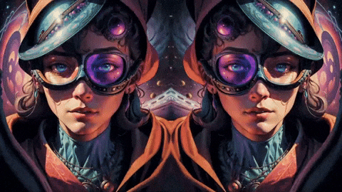
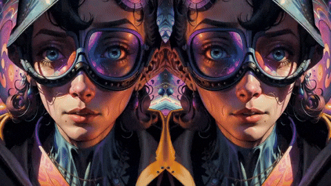

# ProtoNull - Mushroots23

This Python-based visualizer is made for **live visuals at music events**. It allows you to **mix animations and effects in real time**, all synced to BPM, enabling expressive visual feedback to music.

> ⚠️ This is the **first prototype**. Further development is ongoing using **Unreal Engine 5**.


## **Features**

### **BPM-Synced Playback**

- Animation playback speed = `FPS = BPM / 4`
- Ideal for creating animation loops that match 15-frame beat steps in a 4/4 rhythm


---

### **Three Blendable FX Modules**

Each effect can be controlled and combined in real time for expressive visual output:

#### 1. **Block FX**
Splits the image into shakeable, additive blocks  
→ Joystick controls size, quantity, and movement

>**Example:**  
  
*Block effect with shake*

#### 2. **Trail FX**

New frames are blended with previous ones, creating a motion trail or smear effect

>**Example:**  
  
*Trail effect showing persistent motion blur*

#### 3. **Color FX**
A pulsating color modulation synced to BPM, creating vibrant color shifts

>**Example:**  
  
*Color modulation synced with beat*

---

### **Freeze Frame Mode**

Freezes the current animation frame. When combined with effects, it produces unique results:

**Block + Freeze** → Pixelation-like effect  
>**Example:**  
  
*Frozen blocks create a pixel-style distortion*

**Color + Freeze** → Expanding color noise  
>**Example:**  
  
*Frozen frame with color noise*

---

### **BPM-Based Loop & Navigation**

**Loop modes: sine and saw pattern**

   **Example:**  
   >  
   *Sine Loop playback of Animation*

   >  
   *Saw Loop playback of Animation*

- Adjust loop length via D-pad (double or halve)
- Navigate forward/backward in BPM-accurate frame steps

---

### **Circles**

Optional circle overlays pulse in sync with the BPM, adding rhythmic energy to the animation.

>**Example:**  
  
*Circular overlays emphasizing the beat*

---

### Slot-Based Animation System

- Animations are stored in folders: `slots/slot1/`, `slot2/`, etc.
- Unlimited slots supported - the program automatically detects them
- Slot navigation loops from last back to first
- Supports all resolutions and mirrored animations

---
---


## Controls

> ⚠️ **Full controller support only with a Nintendo Switch Pro Controller**


| Function                                      | Controller                              | Keyboard                      |
|-----------------------------------------------|-----------------------------------------|-------------------------------|
| Fullscreen/Window                             | screenshot button                       |F                              |
| set Bpm                                       | +/-                                     |                               |
| Switch animation slot                         | D-pad left/right                        |                               |
| Change loop size                              | D-pad up/down                           |                               |
| Forward/Backwards                             | L/R                                     |                               |
| Saw Loop                                      | ZL                                      |                               |
| SineLoop                                      | ZR                                      |                               |
| Drop (sine, big circle, block off)            | A                                       |                               |
| Effect intensity                              | X                                       |                               |
| Reset (restart animation, loops off, fx off)  | Y                                       |                               |
| Trail FX intensity                            | Left joystick L/R                       |                               |
| Trail FX reset                                | Click left joystick                     |                               |
| Block FX on/off                               | Click right Joystick                    |                               | 
| Block FX size                                 | Right Joystick L/R                      |                               |
| Block FX movement                             | Right Joystick L/R                      |                               |
| Color FX                                      | Home + ZL                               |                               |
| Freeze                                        | Home + L                                |                               |
| Circles on/off                                | Home + X                                |                               |
| Bid Circles                                   | X                                       |                               |
| Small circles                                 | Y                                       |                               |


---

## Requirements

- Python 3.10+
- `pygame`
- `numpy`

---

## **Getting Started**

(Optional) Prepare your animations and place them as JPG or PNG sequences into `slots/slotX/` folders. 
> ⚠️ If the resolution is taller than it is wide, the animation gets mirrored on the **right side**.


Run the visualizer:
   ```bash
   python main.py
   ```
---
---

## Author

**Mushroots23**  
[github.com/mushroots23](https://github.com/mushroots23)

---

## License

This project is released under the **MIT License** - see [LICENSE](LICENSE) for details.

---

